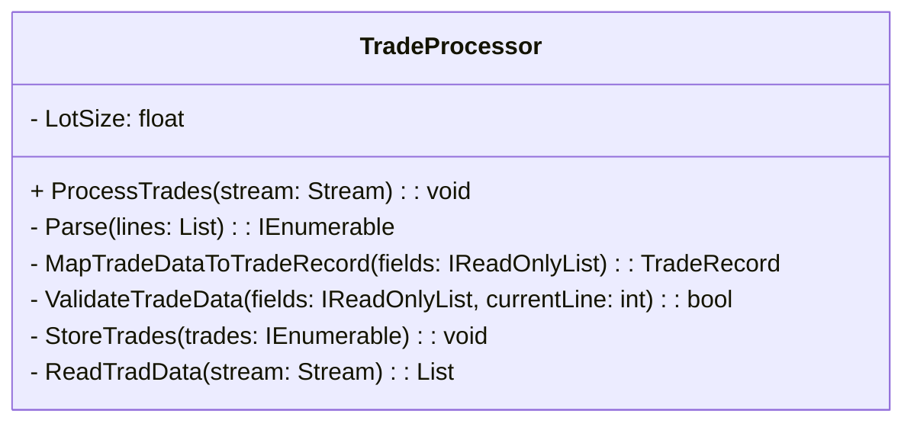
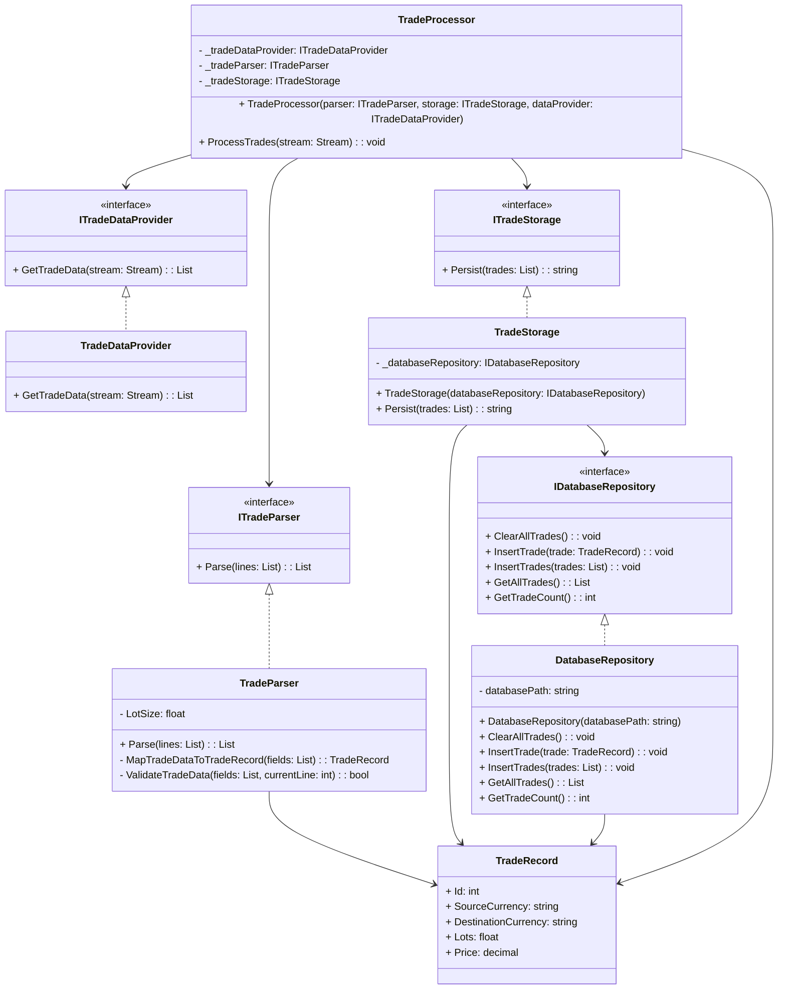

### CS236 Project 1: Updating TradeProcessor Class

> **📋 Assignment Status**: This repository contains the **starting template** for the assignment. The current code represents the "Before" state that violates SOLID principles. Your task is to refactor this code to follow the Single Responsibility Principle (SRP) and implement the facade pattern as described below.

#### Overview

### Before: Monolithic Implementation



### After: SOLID Principles Implementation



In this project, you will change the `TradeProcessor` class to follow the Single Responsibility Principle (SRP) more closely. You will split the different jobs done by the `TradeProcessor` class into separate classes. You will use constructor injection to add these new classes into the updated `TradeProcessor` class. The final version of the `TradeProcessor` class will be a good example of the facade design pattern.

#### Step 1: Understand the Current Code

Look at the current code to understand how it works right now. Notice that the `TradeProcessor` class has static methods. This is because these methods do not use any instance fields.

**Important**: While you are changing the code, carefully consider which methods should remain static versus become instance methods:
- **Static methods**: Pure functions that don't depend on instance state (e.g., data transformation, validation logic)
- **Instance methods**: Methods that need access to injected dependencies or instance fields

**Current TradeProcessor Methods Analysis**:
- `ProcessTrades()` - Will become instance method (needs dependencies)
- `ReadTradData()` - Will move to TradeDataProvider
- `Parse()` - Will move to TradeParser
- `MapTradeDataToTradeRecord()` - Consider: Does this need instance state?
- `ValidateTradeData()` - Consider: Does this need instance state?
- `StoreTrades()` - Will move to TradeStorage

#### Step 2: Find SRP Violations

Find and list the different reasons that might make you change the `TradeProcessor` class, showing that it does not follow the SRP properly. See how the class is doing many jobs like getting data from a stream, turning stream lines into trade records, checking trade data, and saving the data in a database.

#### Step 3: Create Interfaces

Create the following interfaces to represent the separated jobs:

- `ITradeDataProvider`: This should have the function `List<string> GetTradeData(Stream stream)`.
- `ITradeParser`: This should have the method `List<TradeRecord> Parse(List<string> lines)`.
- `ITradeStorage`: This should have the function `string Persist(List<TradeRecord> trades)`.

#### Step 4: Implement Classes

Create separate classes to implement the interfaces you made in step 3:

- `TradeDataProvider` for `ITradeDataProvider`.
- `TradeParser` for `ITradeParser`.
- `TradeStorage` for `ITradeStorage`.

Move the right methods from the original `TradeProcessor` class to these new classes. Decide which methods should stay static based on whether they use instance fields.

**Method Migration Guide**:
- `ReadTradData()` → Move to `TradeDataProvider.GetTradeData()`
- `Parse()` → Move to `TradeParser.Parse()`
- `StoreTrades()` → Move to `TradeStorage.Persist()`
- `MapTradeDataToTradeRecord()` and `ValidateTradeData()` → Move to `TradeParser` (as helper methods)

**Validation Criteria for Step 4**:
- Each implementation class should have only the methods related to its single responsibility
- The `LotSize` constant should move to the `TradeParser` class
- Only `DatabaseRepository` should reference `LiteDB`; other classes should depend on `IDatabaseRepository`
- No class should directly reference `Console.WriteLine` except where appropriate for logging

#### Step 5: Apply Dependency Inversion Principle - Create Database Abstraction

The current `TradeStorage` implementation still violates the **Dependency Inversion Principle** because it depends directly on the concrete `DatabaseRepository` class. To complete the SOLID implementation, you need to create an interface abstraction.

**Create IDatabaseRepository Interface**:

Create an `IDatabaseRepository` interface that defines the contract for database operations:

```csharp
public interface IDatabaseRepository
{
    /// <summary>
    /// Clears all existing trade records from the database.
    /// </summary>
    void ClearAllTrades();

    /// <summary>
    /// Inserts a single trade record into the database.
    /// </summary>
    /// <param name="trade">The trade record to insert</param>
    void InsertTrade(TradeRecord trade);

    /// <summary>
    /// Inserts multiple trade records into the database efficiently.
    /// </summary>
    /// <param name="trades">The collection of trade records to insert</param>
    void InsertTrades(IEnumerable<TradeRecord> trades);

    /// <summary>
    /// Retrieves all trade records from the database.
    /// </summary>
    /// <returns>List of all trade records in the database</returns>
    List<TradeRecord> GetAllTrades();

    /// <summary>
    /// Gets the count of trade records in the database.
    /// </summary>
    /// <returns>Number of trade records</returns>
    int GetTradeCount();
}
```

**Update DatabaseRepository to Implement Interface**:

Modify the `DatabaseRepository` class to implement the `IDatabaseRepository` interface:

```csharp
public class DatabaseRepository : IDatabaseRepository
{
    // Keep all existing implementation, just add the interface
}
```

**Update TradeStorage to Use Interface**:

Modify the `TradeStorage` class to depend on the `IDatabaseRepository` interface instead of the concrete class:

```csharp
public class TradeStorage : ITradeStorage
{
    private readonly IDatabaseRepository _databaseRepository;

    public TradeStorage(IDatabaseRepository databaseRepository)
    {
        _databaseRepository = databaseRepository;
    }

    public string Persist(List<TradeRecord> trades)
    {
        _databaseRepository.ClearAllTrades();
        _databaseRepository.InsertTrades(trades);
        return $"INFO: {trades.Count} trades processed";
    }
}
```

**Why This Matters - Dependency Inversion Principle**:

- **High-level modules** (TradeStorage) should not depend on **low-level modules** (DatabaseRepository)
- Both should depend on **abstractions** (IDatabaseRepository interface)
- This makes the code more **testable** (you can mock the interface)
- This makes the code more **flexible** (you can swap database implementations)
- This completes the **SOLID principles** implementation

#### Step 6: Update TradeProcessor Class

Change the `TradeProcessor` class to use constructor injection, making it use instances of `ITradeDataProvider`, `ITradeParser`, and `ITradeStorage` to do its jobs. Here is how the `ProcessTrades` method should look:

```csharp
public void ProcessTrades(Stream stream)
{
    var lines = _tradeDataProvider.GetTradeData(stream);
    var trades = _tradeParser.Parse(lines);
    _tradeStorage.Persist(trades);
}
```

#### Step 7: Update Main Program

Change the main program to create all dependencies with proper interface-based dependency injection. Notice how we create the concrete `DatabaseRepository` but pass it as the `IDatabaseRepository` interface:

```csharp
private static void Main()
{
    using var tradeStream = File.OpenRead("trades.txt");

    // Create the database repository (concrete implementation of interface)
    IDatabaseRepository databaseRepository = new DatabaseRepository();

    // Create TradeStorage with IDatabaseRepository dependency (interface-based dependency injection)
    var tradeStorage = new TradeStorage(databaseRepository);

    // Create TradeProcessor with all dependencies
    var tradeProcessor = new TradeProcessor(new TradeParser(), tradeStorage, new TradeDataProvider());
    tradeProcessor.ProcessTrades(tradeStream);

    // Display all trades from the database
    databaseRepository.GetAllTrades().ForEach(Console.WriteLine);
}
```

**Key Points About This Implementation**:

- We create `DatabaseRepository` but assign it to `IDatabaseRepository` interface type
- `TradeStorage` receives the interface, not the concrete class
- This demonstrates **Dependency Inversion Principle** in action
- The code is now fully testable and follows all **SOLID principles**

### Automated Tests

This repository includes a full NUnit test project to guide and verify your SOLID refactor.

- Test project: `solid-project-1.Tests`
- Test runner: `dotnet test`
- Test framework: NUnit + Moq (for mocking)
- Coverage: coverlet.collector (optional)

#### How to run tests

From the repository root:

```bash
# Run all tests in the test project
dotnet test solid-project-1.Tests/solid-project-1.Tests.csproj

# (Optional) Collect code coverage
dotnet test solid-project-1.Tests/solid-project-1.Tests.csproj -p:CollectCoverage=true
```

You can also run tests from your IDE’s Test Explorer (Rider/VS/VS Code with C# extensions).

#### Progressive Test Enabling

Tests are organized to match the learning steps. Start with the already-enabled tests, then progressively uncomment additional tests as you implement each step:

- DatabaseRepository tests are fully enabled now (they should pass immediately)
- Interface and implementation tests are organized by steps and include clear "STEP 3/4/5" comments
- After each implementation step, uncomment the next set of tests and re-run

See the detailed testing guide for exact file-by-file instructions:

- `solid-project-1.Tests/README-Tests.md`

### Diagrams

The “Before” and “After” class diagrams are embedded above using Mermaid so they render inline on GitHub and in modern Markdown viewers. These versions replace the previous PlantUML-generated PNG images and stay in sync with the codebase.
