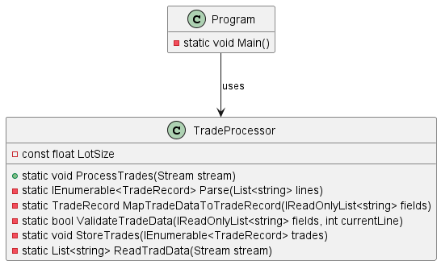

### CS236 Project 1: Updating TradeProcessor Class

#### Overview
### Before

### After

In this project, you will change the `TradeProcessor` class to follow the Single Responsibility Principle (SRP) more closely. You will split the different jobs done by the `TradeProcessor` class into separate classes. You will use constructor injection to add these new classes into the updated `TradeProcessor` class. The final version of the `TradeProcessor` class will be a good example of the facade design pattern.


#### Step 1: Understand the Current Code

Look at the current code to understand how it works right now. Notice that the `TradeProcessor` class has static methods. This is because these methods do not use any instance fields. While you are changing the code, some methods should remain static if they don't need to use instance fields.

#### Step 2: Find SRP Violations

Find and list the different reasons that might make you change the `TradeProcessor` class, showing that it does not follow the SRP properly. See how the class is doing many jobs like getting data from a stream, turning stream lines into trade records, checking trade data, and saving the data in a database.

#### Step 3: Create Interfaces

Create the following interfaces to represent the separated jobs:

- `ITradeDataProvider`: This should have the function `List<string> GetTradeData(Stream stream)`.
- `ITradeParser`: This should have the method `List<TradeRecord> Parse(List<string> lines)`.
- `ITradeStorage`: This should have the function `string Persist(List<TradeRecord> trades)`.

#### Step 4: Understand Volatile vs Stable Dependencies

Before implementing the classes, it's important to understand the difference between **volatile** and **stable** dependencies:

- **Stable Dependencies**: These are dependencies that rarely change and are predictable. Examples include standard library classes, utility classes, and domain objects.
- **Volatile Dependencies**: These are dependencies that change frequently or are unpredictable. Examples include database access, file I/O, web services, and external APIs.

Database access (like LiteDB operations) is a **volatile dependency** because:
- Database connection strings may change
- Database implementations may be swapped (LiteDB → SQL Server → PostgreSQL)
- Database operations can fail due to external factors
- Testing requires isolation from actual database operations

#### Step 5: Create Database Repository

Create a `DatabaseRepository` class that wraps all database operations. This separates the volatile database dependency from your business logic:

```csharp
public class DatabaseRepository
{
    private readonly string _databasePath;

    public DatabaseRepository(string databasePath = @"trades.db")
    {
        _databasePath = databasePath;
    }

    public void ClearAllTrades() { /* Implementation */ }
    public void InsertTrades(IEnumerable<TradeRecord> trades) { /* Implementation */ }
    public List<TradeRecord> GetAllTrades() { /* Implementation */ }
}
```

#### Step 6: Implement Classes

Create separate classes to implement the interfaces you made in step 3:

- `TradeDataProvider` for `ITradeDataProvider`.
- `TradeParser` for `ITradeParser`.
- `TradeStorage` for `ITradeStorage` - **Important**: This should depend on `DatabaseRepository` as a concrete dependency initially.

Move the right methods from the original `TradeProcessor` class to these new classes. The `TradeStorage` class should accept `DatabaseRepository` through its constructor and use it for all database operations.

#### Step 7: Update TradeProcessor Class

Change the `TradeProcessor` class to use constructor injection, making it use instances of `ITradeDataProvider`, `ITradeParser`, and `ITradeStorage` to do its jobs. Here is how the `ProcessTrades` method should look:

```csharp
public void ProcessTrades(Stream stream)
{
    var lines = _tradeDataProvider.GetTradeData(stream);
    var trades = _tradeParser.Parse(lines);
    var statusMessage = _tradeStorage.Persist(trades);
    Console.WriteLine(statusMessage);
}
```

Notice that `Persist()` now returns a string status message instead of void, which improves testability and provides better feedback.

#### Step 8: Update Main Program

Change the main program to create the required objects with their dependencies. Notice how `TradeStorage` now requires a `DatabaseRepository`:

```csharp
private static void Main()
{
    var tradeStream = File.OpenRead("trades.txt");

    // Create the database repository (concrete dependency)
    var databaseRepository = new DatabaseRepository();

    // Create TradeStorage with DatabaseRepository dependency
    var tradeStorage = new TradeStorage(databaseRepository);

    var tradeProcessor = new TradeProcessor(new TradeParser(), tradeStorage, new TradeDataProvider());
    tradeProcessor.ProcessTrades(tradeStream);

    // Display all trades from the database
    databaseRepository.GetAllTrades().ForEach(Console.WriteLine);
}
```

#### Step 9: Advanced Challenge - Apply Dependency Inversion Principle

Once you have completed the basic implementation, consider this advanced challenge:

The `TradeStorage` class currently depends on the concrete `DatabaseRepository` class. This is still a violation of the **Dependency Inversion Principle** because:

- High-level modules (TradeStorage) should not depend on low-level modules (DatabaseRepository)
- Both should depend on abstractions (interfaces)

**Challenge**: Create an `IDatabaseRepository` interface and modify `TradeStorage` to depend on this interface instead of the concrete class. This will make your code more testable and flexible.

**Benefits of this approach**:

- **Testability**: You can mock `IDatabaseRepository` for unit testing
- **Flexibility**: You can swap database implementations without changing `TradeStorage`
- **SOLID Compliance**: Follows the Dependency Inversion Principle completely

This demonstrates the progression from concrete dependencies (easier to understand) to interface-based dependencies (more flexible and testable).
