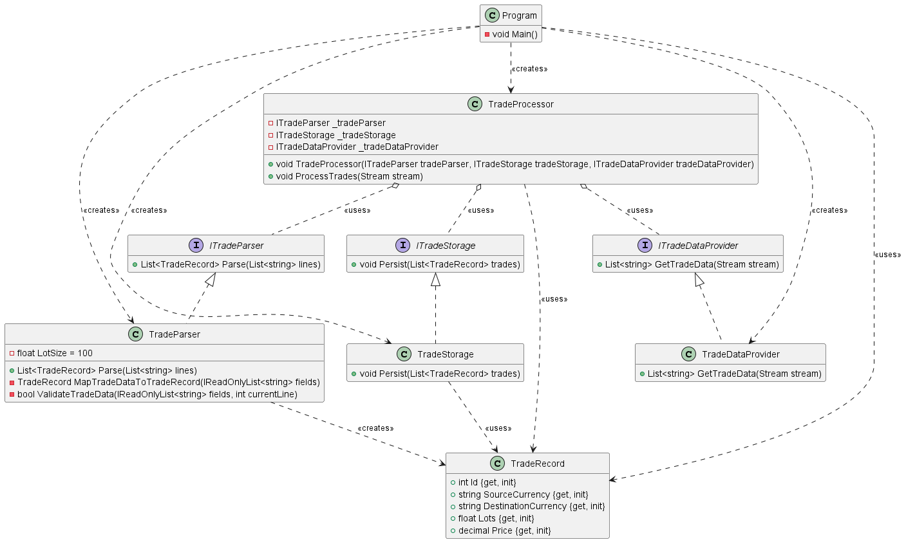

### CS236 Project 1: Updating TradeProcessor Class

> **📋 Assignment Status**: This repository contains the **starting template** for the assignment. The current code represents the "Before" state that violates SOLID principles. Your task is to refactor this code to follow the Single Responsibility Principle (SRP) and implement the facade pattern as described below.

#### Overview

### Before


### After


In this project, you will change the `TradeProcessor` class to follow the Single Responsibility Principle (SRP) more closely. You will split the different jobs done by the `TradeProcessor` class into separate classes. You will use constructor injection to add these new classes into the updated `TradeProcessor` class. The final version of the `TradeProcessor` class will be a good example of the facade design pattern.

#### Step 1: Understand the Current Code

Look at the current code to understand how it works right now. Notice that the `TradeProcessor` class has static methods. This is because these methods do not use any instance fields.

**Important**: While you are changing the code, carefully consider which methods should remain static versus become instance methods:
- **Static methods**: Pure functions that don't depend on instance state (e.g., data transformation, validation logic)
- **Instance methods**: Methods that need access to injected dependencies or instance fields

**Current TradeProcessor Methods Analysis**:
- `ProcessTrades()` - Will become instance method (needs dependencies)
- `ReadTradData()` - Will move to TradeDataProvider
- `Parse()` - Will move to TradeParser
- `MapTradeDataToTradeRecord()` - Consider: Does this need instance state?
- `ValidateTradeData()` - Consider: Does this need instance state?
- `StoreTrades()` - Will move to TradeStorage

#### Step 2: Find SRP Violations

Find and list the different reasons that might make you change the `TradeProcessor` class, showing that it does not follow the SRP properly. See how the class is doing many jobs like getting data from a stream, turning stream lines into trade records, checking trade data, and saving the data in a database.

#### Step 3: Create Interfaces

Create the following interfaces to represent the separated jobs:

- `ITradeDataProvider`: This should have the function `List<string> GetTradeData(Stream stream)`.
- `ITradeParser`: This should have the method `List<TradeRecord> Parse(List<string> lines)`.
- `ITradeStorage`: This should have the function `void Persist(List<TradeRecord> trades)`.

#### Step 4: Implement Classes

Create separate classes to implement the interfaces you made in step 3:

- `TradeDataProvider` for `ITradeDataProvider`.
- `TradeParser` for `ITradeParser`.
- `TradeStorage` for `ITradeStorage`.

Move the right methods from the original `TradeProcessor` class to these new classes. Decide which methods should stay static based on whether they use instance fields.

**Method Migration Guide**:
- `ReadTradData()` → Move to `TradeDataProvider.GetTradeData()`
- `Parse()` → Move to `TradeParser.Parse()`
- `StoreTrades()` → Move to `TradeStorage.Persist()`
- `MapTradeDataToTradeRecord()` and `ValidateTradeData()` → Move to `TradeParser` (as helper methods)

**Validation Criteria for Step 4**:
- Each implementation class should have only the methods related to its single responsibility
- The `LotSize` constant should move to the `TradeParser` class
- No class should directly reference `LiteDB` except `TradeStorage`
- No class should directly reference `Console.WriteLine` except where appropriate for logging

#### Step 5: Update TradeProcessor Class

Change the `TradeProcessor` class to use constructor injection, making it use instances of `ITradeDataProvider`, `ITradeParser`, and `ITradeStorage` to do its jobs. Here is how the `ProcessTrades` method should look:

```csharp
public void ProcessTrades(Stream stream)
{
    var lines = _tradeDataProvider.GetTradeData(stream);
    var trades = _tradeParser.Parse(lines);
    _tradeStorage.Persist(trades);
}
```

#### Step 6: Update Main Program

Change the main program to create `TradeDataProvider`, `TradeParser`, and `TradeStorage` objects, and then add them to `TradeProcessor` through its constructor. Use this main method:

```csharp
 private static void Main()
{
    var tradeStream = File.OpenRead("trades.txt");
    var tradeProcessor = new TradeProcessor(new TradeParser(), new TradeStorage(), new TradeDataProvider());
    tradeProcessor.ProcessTrades(tradeStream);

    using var db = new LiteRepository(@"trades.db");

    db.Query<TradeRecord>().ToList().ForEach(Console.WriteLine);
}
```

### Detailed Diagram


## 📋 Assignment Completion Checklist

Use this checklist to track your progress and ensure you've completed all requirements:

### Phase 1: Analysis and Planning
- [ ] **Step 1 Complete**: Analyzed current code and identified static methods
- [ ] **Step 2 Complete**: Listed all SRP violations in TradeProcessor class
  - [ ] Identified data reading responsibility
  - [ ] Identified parsing responsibility
  - [ ] Identified validation responsibility
  - [ ] Identified storage responsibility
  - [ ] Identified logging responsibility

### Phase 2: Interface Design
- [ ] **Step 3 Complete**: Created all required interfaces
  - [ ] `ITradeDataProvider.cs` with correct method signature
  - [ ] `ITradeParser.cs` with correct method signature
  - [ ] `ITradeStorage.cs` with correct method signature

### Phase 3: Implementation
- [ ] **Step 4 Complete**: Created implementation classes
  - [ ] `TradeDataProvider.cs` implements `ITradeDataProvider`
  - [ ] `TradeParser.cs` implements `ITradeParser`
  - [ ] `TradeStorage.cs` implements `ITradeStorage`
  - [ ] Moved appropriate methods from original TradeProcessor
  - [ ] Decided correctly which methods should remain static

### Phase 4: Refactoring
- [ ] **Step 5 Complete**: Updated TradeProcessor class
  - [ ] Changed from static to instance class
  - [ ] Added constructor with dependency injection
  - [ ] Added private readonly fields for dependencies
  - [ ] ProcessTrades method matches the required signature
  - [ ] ProcessTrades method delegates to injected dependencies

### Phase 5: Integration
- [ ] **Step 6 Complete**: Updated Main program
  - [ ] Creates instances of all implementation classes
  - [ ] Passes dependencies to TradeProcessor constructor
  - [ ] Calls instance method (not static) on TradeProcessor

### Verification Tests
- [ ] **Build Test**: Solution compiles without errors
- [ ] **Functionality Test**: Program produces same output as before refactoring
- [ ] **Architecture Test**: TradeProcessor class now follows facade pattern
- [ ] **Dependency Test**: All dependencies are injected, no direct instantiation in TradeProcessor

## 🎯 Self-Assessment Questions

Before submitting, ask yourself:

1. **Single Responsibility**: Does each class have only one reason to change?
2. **Dependency Injection**: Are all dependencies passed through constructors?
3. **Facade Pattern**: Does TradeProcessor simply coordinate other classes?
4. **Static vs Instance**: Did you correctly identify which methods should remain static?
5. **Interface Contracts**: Do your implementations match the interface signatures exactly?

## 🚀 Getting Started Tips

1. **Start Small**: Begin with creating the interfaces - they're the contracts for your design
2. **One Step at a Time**: Complete each step fully before moving to the next
3. **Test Frequently**: After each step, ensure your code still compiles
4. **Compare Diagrams**: Use the Before/After UML diagrams to guide your refactoring
5. **Method Signatures**: Pay careful attention to return types and parameter types
