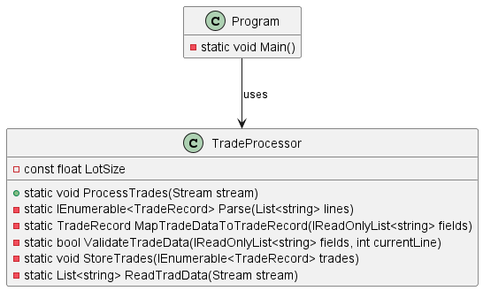
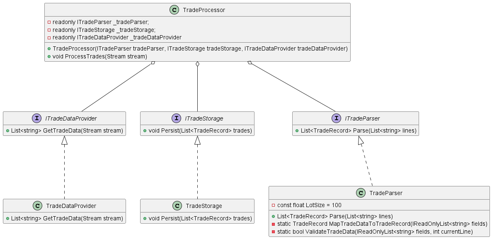
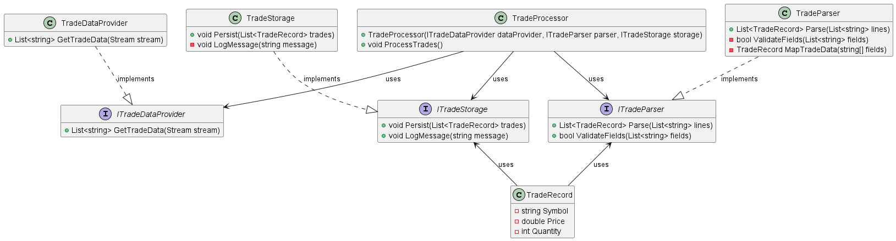

### CS236 Project 1: Updating TradeProcessor Class

#### Overview
### Before

### After

In this project, you will change the `TradeProcessor` class to follow the Single Responsibility Principle (SRP) more closely. You will split the different jobs done by the `TradeProcessor` class into separate classes. You will use constructor injection to add these new classes into the updated `TradeProcessor` class. The final version of the `TradeProcessor` class will be a good example of the facade design pattern.


#### Step 1: Understand the Current Code

Look at the current code to understand how it works right now. Notice that the `TradeProcessor` class has static methods. This is because these methods do not use any instance fields. While you are changing the code, some methods should remain static if they don't need to use instance fields.

#### Step 2: Find SRP Violations

Find and list the different reasons that might make you change the `TradeProcessor` class, showing that it does not follow the SRP properly. See how the class is doing many jobs like getting data from a stream, turning stream lines into trade records, checking trade data, and saving the data in a database.

#### Step 3: Create Interfaces

Create the following interfaces to represent the separated jobs:

- `ITradeDataProvider`: This should have the function `List<string> GetTradeData(Stream stream)`.
- `ITradeParser`: This should have the method `List<TradeRecord> Parse(List<string> lines)`.
- `ITradeStorage`: This should have the function `void Persist(List<TradeRecord> trades)`.

#### Step 4: Implement Classes

Create separate classes to implement the interfaces you made in step 3:

- `TradeDataProvider` for `ITradeDataProvider`.
- `TradeParser` for `ITradeParser`.
- `TradeStorage` for `ITradeStorage`.

Move the right methods from the original `TradeProcessor` class to these new classes. Decide which methods should stay static based on whether they use instance fields.

#### Step 5: Update TradeProcessor Class

Change the `TradeProcessor` class to use constructor injection, making it use instances of `ITradeDataProvider`, `ITradeParser`, and `ITradeStorage` to do its jobs. Here is how the `ProcessTrades` method should look:

```csharp
public void ProcessTrades(Stream stream)
{
    var lines = _tradeDataProvider.GetTradeData(stream);
    var trades = _tradeParser.Parse(lines);
    _tradeStorage.Persist(trades);
}
```

#### Step 6: Update Main Program

Change the main program to create `TradeDataProvider`, `TradeParser`, and `TradeStorage` objects, and then add them to `TradeProcessor` through its constructor. Use this main method:

```csharp
static void Main(string[] args)
{
    ITradeDataProvider dataProvider = new TradeDataProvider();
    ITradeParser parser = new TradeParser();
    ITradeStorage storage = new TradeStorage();
    
    TradeProcessor tradeProcessor = new TradeProcessor(dataProvider, parser, storage);
    tradeProcessor.ProcessTrades();
}
```

### Detailed Diagram

